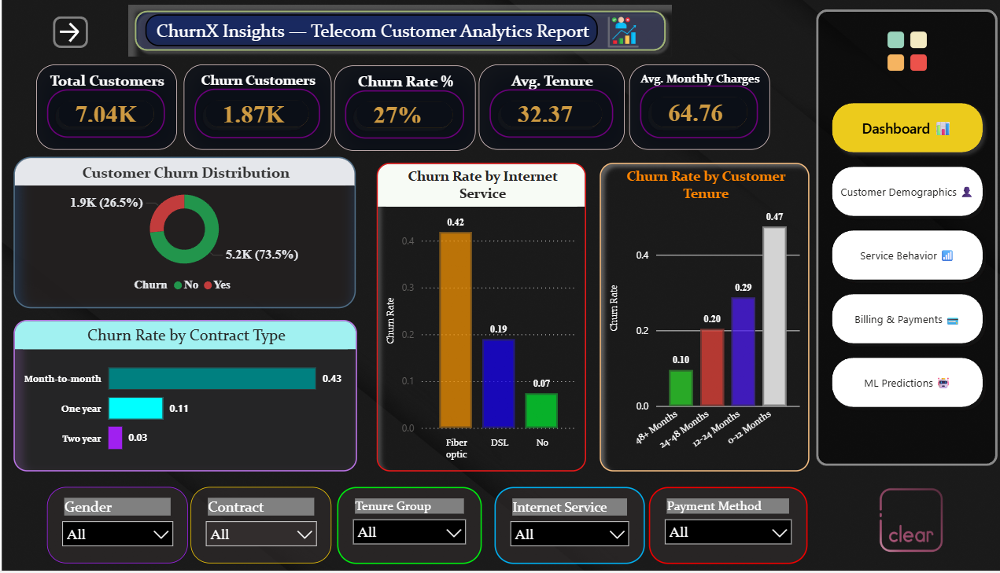
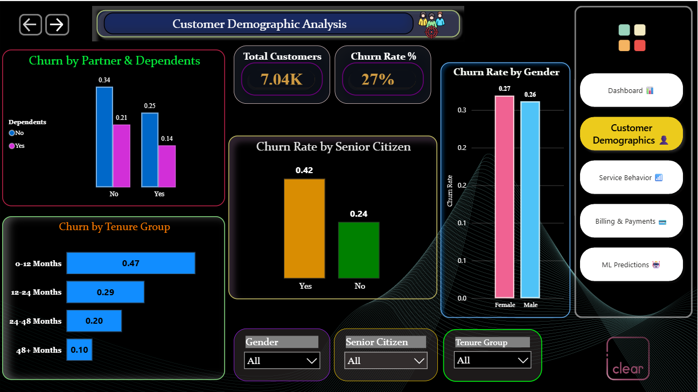
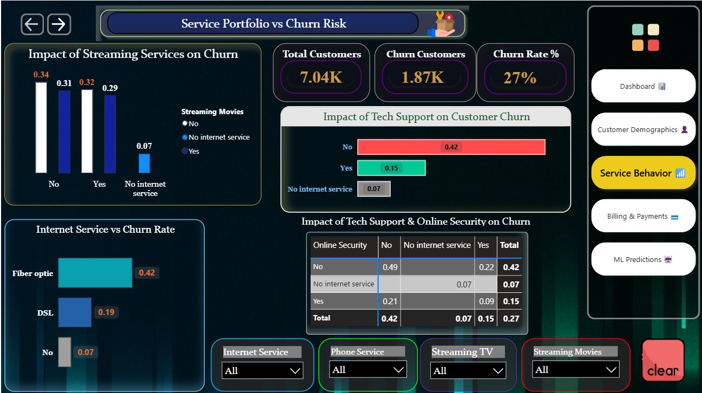

# 📊 Telecom Customer Churn Analysis

## 📌 Project Overview
This project analyzes telecom customer data to identify key factors contributing to customer churn and builds machine learning models to predict customer retention. It demonstrates an end-to-end data analytics workflow from data preprocessing to business insights.

---

## 🎯 Business Objectives
- Identify key drivers of customer churn  
- Analyze customer demographics and behavior  
- Build predictive models to identify high-risk customers  
- Provide actionable recommendations for customer retention  

---

## 🛠️ Tech Stack
- Python (Pandas, NumPy, Scikit-learn)
- SQL
- Power BI
- Excel

---

## 🤖 Machine Learning Models
- Logistic Regression (Accuracy: 81%)  
- Random Forest  
- XGBoost  

---

## 📊 Key Insights
- Customers with high monthly charges are more likely to churn  
- Long-term customers show lower churn rates  
- Certain service and contract types influence churn significantly  
- Customers with multiple services show different churn behavior  

---

## 📈 Business Impact
- Helps telecom companies identify high-risk customers  
- Supports targeted retention strategies  
- Enables data-driven decision-making to reduce churn  

---

## 📸 Analysis Preview

### Dashboard

### Customer Demographics

### Service Behavior

### Billing & Payments

### ML Predictions

---

## 📎 Project Links
- 🔗 [View Power BI Dashboard](https://app.powerbi.com/view?r=eyJrIjoiNDVhOTM5YTEtZjI2MC00ZTRmLThkM2UtOWRhZWQ1ZmY1ZGRhIiwidCI6IjgzY2U2OTI0LTViZjctNDE3ZS05YWZjLWMxOWQ4YjZkYzAwOCJ9)

---

## 🧾 SQL Analysis
- `table_creation.sql` → Database schema creation  
- `data_cleaning.sql` → Data preprocessing  
- `data_analysis.sql` → KPI generation and insights  

📂 Available in the `/sql` folder  

---

## 📊 Excel Analysis
- `churn_dashboard.xlsx` → Excel dashboard  
- `pivot_analysis.xlsx` → Pivot-based analysis  

---

## 📄 Documentation
Detailed project report explaining methodology, analysis, and results  

📂 Available in the `/docs` folder  

---

## 🚀 Key Skills Demonstrated
- Data Cleaning & Preprocessing  
- Exploratory Data Analysis (EDA)  
- Machine Learning Model Building  
- Model Evaluation  
- Data Visualization  
- Business Insight Generation  
